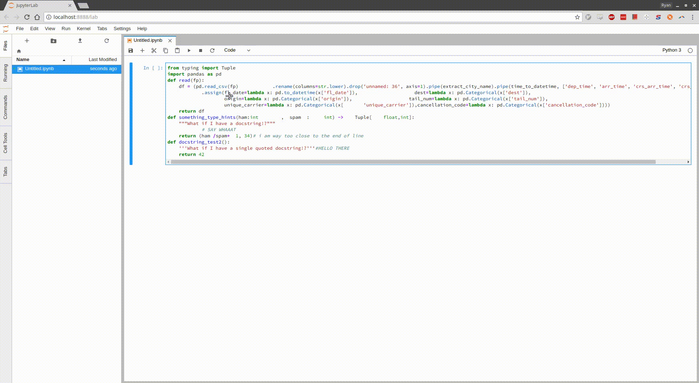

# jupyterlab_black

[](https://badge.fury.io/js/%40ryantam626%2Fjupyterlab_black)
[](https://badge.fury.io/js/%40ryantam626%2Fjupyterlab_black)

A JupyterLab extension to apply [Black](https://github.com/ambv/black) formatter to code within codecell.

> Note: This extension will only work if you can load the terminal in jupyterlab. The terminal does [not currently work on Windows 7](https://github.com/jupyterlab/jupyterlab/issues/3647)

Here is a little demo. Apologies for the horrid quality, I promise to find a better converter... And also to folks trying to view this in npm and seeing just a blank space :(



## Prerequisites

* JupyterLab
* A Python 3.6+ anywhere on your system with `black` installed

## Installation

From your existing environment with jupyterlab installed do the following:

```bash
jupyter labextension install @ryantam626/jupyterlab_black
```

### Python3.6+ Kernel Notes

Install black with something like:

```base
conda install -c conda-forge black
```

OR

```base
pip install black
```

Find out path of your Python by `which python` and that would be what to put for `blackPythonBin` in the Usage section.

### How about a keyboard shortcut?

Add an extra extry to your keyboard shortcuts settings with something like

```
{"jupyterlab_black:format":{
    "command": "jupyterlab_black:format",
    "keys": [
        "Ctrl K",
        "Ctrl L"
    ],
    "selector": ".jp-Notebook.jp-mod-editMode"
}}
```

This basically says "Under edit mode (detected through the selector), using the chord Ctrl K + Ctrl L, invoke the `jupyterlab_black:format` command". And there you have it :tada:

### Non-Python3.6+ Kernel Notes

If you are using kernel that are not Python3.6+, create another environment with Python3.6+ and black installed, for example (with conda, my perferred environment manager):

```bash
conda create --name py36_for_jupyterlab_black -c conda-forge python=3.6 black
```

Then find out where this lives by:

```bash
source activate py36_for_jupyterlab_black
which python
```

It should be something like `/home/ryan/lib/anaconda2/envs/py36_for_jupyterlab_black/bin/python`, depending on your distribution of conda, that would be what to put for `blackPythonBin` in the Usage section.

### Usage

Head over to settings editor, and key in the python interpreter path of that Python3.6+ you have with black installed for `blackPythonBin`.

There is literally one option in the command palette right now:

* `Apply Black Formatter`

## What are all these terminals spawning in my JupyterLab!?

Since this plugin uses JupyterLab's terminal functionaility to facilitate support of non-Python3.6+ kernels, and the lack of ability to name JupyterLab terminals, every time the plugin is loaded, it would spawn a new terminal and use that. So if you are refreshing your JupyterLab tab constantly in your browser, this would spawn many many terminals sadly. Also, beware of which terminal you close, as the plugin will stop functioning when the terminal it's using is closed.

## What is this `unset HISTFILE` business??

As above, since JupyterLab's terminal is used, `unset HISTFILE` effectively prevent `jupyterlab_black` to further pollutes the user's shell history.

## Development

For a development install (requires npm version 4 or later), do the following in the repository directory:

```bash
npm install
npm run build
jupyter labextension install . --no-build
```

Get npm and jupyter to watch for changes:

```bash
npm run watch  # in terminal 1
jupyter lab --watch  # in terminal 2
```
